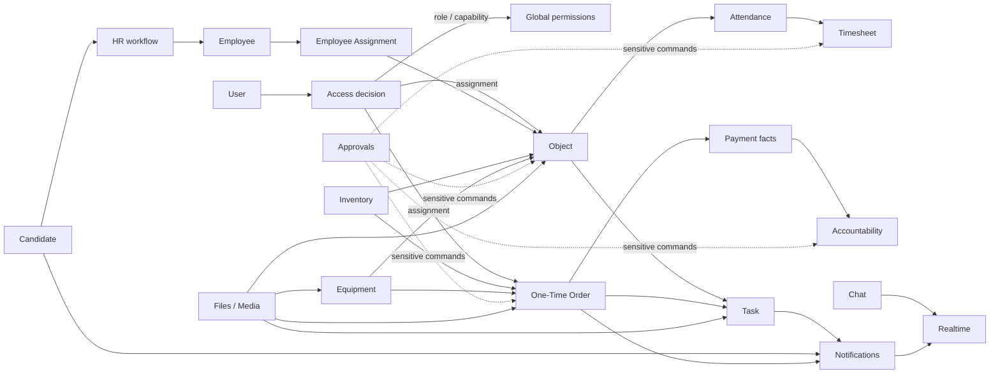
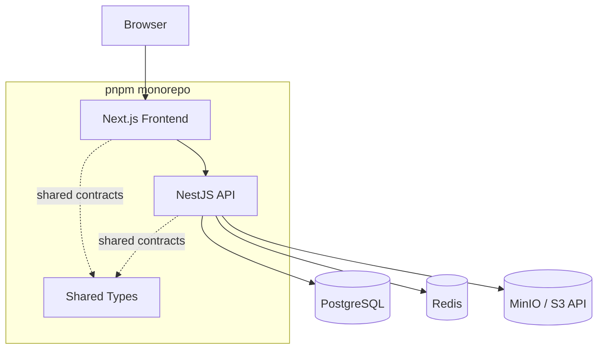
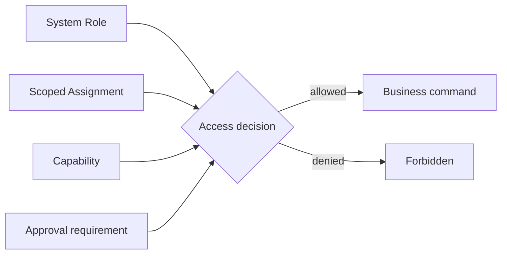

<div align="center">

# Service Ops CRM

### Операционная CRM для управления сервисным бизнесом — единая система для объектов, людей, задач, разовых заказов, табеля, склада, оборудования и финансовой ответственности.

**Product owner · Architecture · Lead development — Дмитрий Крючков**

[](https://github.com/JSwhiz/service-ops-crm/actions/workflows/ci.yml)


[](LICENSE)

</div>

---

## О проекте

**Service Ops CRM** — full-stack operational system для ежедневного управления сервисной компанией. Она объединяет регулярные объекты, разовые заказы, сотрудников, кандидатов, задачи, attendance, табель, складские движения, оборудование, подотчёт, approvals, файлы, коммуникации и уведомления в одной согласованной domain model.

Это не демонстрационный CRUD и не коллекция независимых административных страниц. Основная сложность проекта находится в связях между доменами: назначение сотрудника влияет на доступный operational context и исторические данные; задача наследует scope связанной сущности; стоимость складской операции должна сохраняться на момент события; финансовое действие может требовать отдельного permission и approval; текущая конфигурация не должна переписывать историю задним числом.

> [!IMPORTANT]
> Репозиторий публичен как техническая презентация проекта, но исходный код распространяется на условиях **proprietary license**. Публичный доступ к коду не означает разрешение использовать, копировать, модифицировать, развёртывать или распространять систему. См. [`LICENSE`](LICENSE).

> [!NOTE]
> В репозитории и README намеренно отсутствуют реальные имена сотрудников/заказчиков, названия реальных объектов, production-адреса, credentials и любые customer-specific данные. Все примеры относятся только к абстрактной продуктовой модели.

### Engineering highlights

| | |
| --- | --- |
| **Architecture** | TypeScript monorepo + modular NestJS backend + Next.js frontend |
| **Authorization** | `system role + scoped assignment + capability + approval`, backend-authoritative |
| **Data integrity** | historical values, price snapshots, movement history, immutable financial corrections where required |
| **Operational scopes** | Objects и One-Time Orders имеют собственные assignments и access boundaries |
| **Cross-domain workflows** | Tasks, approvals, notifications, files и finance связывают домены без их слияния |
| **Infrastructure** | PostgreSQL + Redis + MinIO, локально через Docker Compose |
| **Quality gate** | typecheck, lint, builds, Prisma deploy, integration tests в GitHub Actions |
| **Release safety** | versioned migrations, exact SHA releases, backup-first production policy |

### Ветки

- `main` — стабильная ветка;
- `dev` — активная интеграционная ветка;
- `feature/*` — изолированная разработка изменений.

Текущий engineering baseline и актуальная разработка ведутся в `dev`. Публикация presentation-версии README в default branch отслеживается отдельно, чтобы не смешивать документационный release с runtime changes.

---

## Содержание

- [Что решает система](#что-решает-система)
- [Карта доменов](#карта-доменов)
- [Архитектура](#архитектура)
- [Почему архитектура устроена именно так](#почему-архитектура-устроена-именно-так)
- [Модель доступа](#модель-доступа)
- [Ключевые домены](#ключевые-домены)
- [Golden paths](#golden-paths)
- [Технологический стек](#технологический-стек)
- [Структура репозитория](#структура-репозитория)
- [Backend](#backend)
- [Frontend](#frontend)
- [Данные, файлы и realtime](#данные-файлы-и-realtime)
- [Быстрый старт](#быстрый-старт)
- [Локальная разработка](#локальная-разработка)
- [Environment](#environment)
- [Prisma и миграции](#prisma-и-миграции)
- [Качество, тесты и CI](#качество-тесты-и-ci)
- [Production safety](#production-safety)
- [Как вносить изменения](#как-вносить-изменения)
- [Документация](#документация)
- [Автор и ownership](#автор-и-ownership)
- [Лицензия](#лицензия)

---

## Что решает система

В операционном сервисном бизнесе одна операция редко живёт в одной таблице.

Сотрудник назначается на объект, затем его фактическое присутствие отражается в attendance и становится частью табеля. Разовый заказ имеет собственных менеджеров, участников, техническую часть, задачи, файлы и payment flow. Выдача расходника должна сохранить цену операции; выдача оборудования — изменить местоположение конкретной unit, но не «списать» её. Подотчёт должен позволять восстановить последовательность funding → expense → reconciliation. Sensitive action может быть разрешён пользователю, но всё равно требовать отдельного approval.

Service Ops CRM строится вокруг этих связей.

| Контур | Назначение |
| --- | --- |
| **Objects** | регулярные объекты, ответственные, менеджеры, staffing и operational context |
| **Object Operations** | attendance, ежедневные факты, reports, comments и feed |
| **One-Time Orders** | разовые заказы, scoped managers, календарь, выполнение, review и payments |
| **Tasks** | несколько исполнителей, scope/visibility, сроки, результат и подтверждение |
| **Employees** | HR registry, состояние сотрудника, ставки и история назначений |
| **Candidates** | candidate pipeline, assignment, SLA и reminder workflow |
| **Timesheets** | исторический учёт значений по дням/месяцам |
| **Inventory** | центральный количественный ledger и price snapshots |
| **Equipment** | unit-based equipment lifecycle и movement history |
| **Accountability** | funding, expenses, reconciliation и финансовая история |
| **Approvals** | cross-domain подтверждение чувствительных действий |
| **Chat** | комнаты, сообщения и realtime коммуникация |
| **Notifications** | access-aware delivery событий и deep links |
| **Files** | общая attachment/storage/preview platform capability |
| **Users & Access** | authentication, roles, permissions и scoped access |

---

## Карта доменов



Диаграмма показывает **conceptual relationships**, а не физическую Prisma ERD. Полная data model существенно шире и фиксируется в [`schema.prisma`](apps/backend/prisma/schema.prisma), versioned migrations и специализированной документации.

---

## Архитектура

Проект реализован как **TypeScript monorepo**. Backend — модульное NestJS-приложение, frontend — Next.js-приложение, shared contracts вынесены в workspace packages. PostgreSQL хранит транзакционное состояние, Redis обслуживает realtime/infrastructure concerns, MinIO — бинарные файлы и media.



### Почему modular monolith

Домены разделены на NestJS modules, но остаются в одном deployable backend. Это сознательная архитектурная граница.

У продукта много транзакционно связанных workflows: Object ↔ Employee Assignment ↔ Attendance ↔ Timesheet; One-Time Order ↔ Task ↔ Payment ↔ Accountability; Inventory/Equipment ↔ operational scopes. На текущем масштабе modular monolith позволяет сохранять чёткие domain boundaries и транзакционную согласованность без преждевременной сетевой сложности микросервисов.

Разбиение на отдельные services должно происходить только когда появится измеримая причина: независимое масштабирование, отдельный deployment lifecycle, fault isolation или организационная граница команды.

---

## Почему архитектура устроена именно так

### `User != Employee`

**User** — субъект авторизации. Он входит в CRM, имеет system role, permissions/capabilities и scoped assignments.

**Employee** — HR/операционная сущность. Сотрудник может работать на объектах, иметь ставку, график и историю назначений, но не иметь CRM-аккаунта. И наоборот, системный пользователь не обязан быть линейным сотрудником.

Слияние этих моделей связывало бы authentication lifecycle с кадровым lifecycle и делало бы access control зависимым от HR-данных. Поэтому `user != employee` — базовый invariant.

### `System Role != Scoped Assignment`

`manager` как глобальная роль и `manager` как назначение на конкретный Object — разные понятия.

System role отвечает за глобальный уровень ответственности. Scoped assignment отвечает за доступ к конкретной operational entity. Назначение на один Object не должно случайно открывать все Objects; `one_time_manager` одного заказа не превращает пользователя в global manager.

### `Staffing != Attendance != Timesheet`

- **Staffing** — кто относится к составу объекта.
- **Attendance** — кто фактически присутствовал в конкретную дату.
- **Timesheet** — исторический учётный слой.

Если табель строить только из текущего staffing, прошлые строки исчезнут после перевода сотрудника. Если прошлые дни пересчитывать по текущей ставке, финансовая история изменится задним числом. Поэтому historical facts/value сохраняются отдельно.

### `Inventory != Equipment`

Inventory — количественный ledger расходуемых позиций.

Equipment — unit-based lifecycle конкретных физических единиц. Выдача расходника уменьшает складской остаток; выдача оборудования меняет current assignment/status конкретной unit и добавляет movement history.

### Snapshot вместо реконструкции прошлого

Audit-sensitive данные сохраняют значение **на момент события**. Примеры:

- inventory movement хранит price snapshot;
- timesheet сохраняет authoritative daily value;
- equipment использует movement history;
- accountability хранит funding/expense/reconciliation events;
- sensitive workflows используют отдельные approval/correction records.

Это уменьшает зависимость истории от текущего mutable state.

---

## Модель доступа

Authorization не сводится к одному `role` в таблице пользователей. Решение об операции строится из четырёх слоёв.



### 1. System role

Глобальный уровень ответственности пользователя: leadership, management, HR, technical/system roles.

### 2. Scoped assignment

Связь пользователя с конкретной operational entity:

```text
Object
  ├── responsible
  └── manager

One-Time Order
  └── one_time_manager
```

Assignment не является global role.

### 3. Capability / permission

Capability разрешает конкретное действие, которое нельзя безопасно вывести только из названия роли.

Примеры подхода:

```text
employees.view
employees.edit
employees.archive
employees.assignments.manage

timesheet.manual_correction

one_time_order.manage_all
one_time_order.review.edit
one_time_order.calendar.manage
```

### 4. Approval

Некоторые sensitive commands требуют не только права инициировать действие, но и отдельного подтверждения. Approval существует как cross-domain mechanism, а не как набор несогласованных `approved: boolean` внутри разных таблиц.

> [!CAUTION]
> **Backend permissions are authoritative.** Скрытие кнопки во frontend — UX, а не security boundary. Любой endpoint/command обязан валидировать access на backend.

Канонические правила: [`Product Contract`](docs/product/product-contract.md) и [`Access Matrix`](docs/architecture/access-matrix.md).

---

## Ключевые домены

### Objects и Object Operations

Object — регулярная operational entity. Вокруг него строятся scoped users, employee staffing, attendance, timesheet, reports, files, inventory/equipment operations и связанные tasks.

Master-data объекта отделена от ежедневной operational activity. Это позволяет различать право изменить core/financial fields и право вести ежедневную работу.

### One-Time Orders

One-Time Order — самостоятельный домен, а не разновидность Object. Он имеет собственный assignment scope, календарь, managers, participants, operational lifecycle, review, planned/actual payment facts, files, tasks и связь с accountability.

Доступ к заказу не должен автоматически расширять global permissions пользователя.

### Tasks

Task — workflow entity, а не `title + done`.

Модель поддерживает несколько исполнителей, priority, сроки, связь с Object/One-Time Order, visibility, work result, подтверждение и lifecycle:

```text
in_progress
  → awaiting_confirmation
  → pending_auto_close
  → completed
```

UI-команда не должна обходить lifecycle прямой установкой финального статуса. Unresolved product decisions и найденные ACL drift фиксируются отдельно до изменения поведения.

### Employees

Employee registry хранит HR/operational данные независимо от Users. Current assignments и assignment history — разные представления одного lifecycle; удаление назначения не означает удаление Object.

Отдельные permissions управляют view/edit/archive/restore/assignment operations.

### Candidates

Candidate — отдельная сущность до employee lifecycle. Candidate workflow включает assignment, статус обработки, SLA/reminders и notifications. Reserve-представления должны выводиться из candidate domain, а не разрушать границу `Candidate != Employee`.

### Attendance & Timesheet

Attendance фиксирует факт присутствия. Timesheet хранит day/month accounting values.

Persisted historical values authoritative для прошлого периода и не должны переписываться из-за новой текущей ставки или текущего назначения. Manual correction имеет более узкую permission boundary, чем обычный просмотр.

### Inventory

Inventory — центральный складской ledger. Остаток выводится из movements. Financially significant movement сохраняет `unitPriceSnapshot`/`totalAmountSnapshot`, поэтому новая закупочная цена не меняет старые операции.

### Equipment

Equipment — unit-based domain. Конкретная единица имеет current status/current assignment и отдельную movement history. Возможные состояния включают хранение, назначение на Object/One-Time Order, repair, broken, lost, written-off.

### Accountability

Accountability хранит последовательность financial events: funding, expenses, reconciliation и corrections. Это отдельный audit-sensitive domain, а не вычисляемое поле «долг пользователя».

### Approvals

Approvals — cross-domain слой sensitive actions. Он отделяет право запросить изменение от права применить критичное изменение без контроля.

### Chat

Chat — communication subsystem с rooms, messages, replies, reactions, edit/delete semantics и realtime. Domain comments и chat не объединяются: комментарий к сущности и личная/групповая коммуникация решают разные задачи.

### Notifications

Notifications — общий access-aware delivery layer. Уведомление должно соответствовать реальному событию, учитывать permission на target entity и вести по deep link к сущности/действию.

### Files

Files — platform capability поверх MinIO/S3-compatible storage. Разные домены используют единый attachment model и preview/derivative infrastructure вместо page-specific upload implementations.

---

## Golden paths

Golden path проверяет не отдельную страницу, а согласованность нескольких доменов.

```text
Object
  → Employee Assignment
  → Attendance
  → Timesheet
```

```text
One-Time Order
  → scoped manager
  → operational work
  → completion / review
  → payment fact
  → accountability
```

```text
Candidate
  → assignment
  → SLA / reminder
  → decision
  → HR workflow
```

```text
Task
  → scope / visibility
  → assignees
  → work result
  → confirmation when required
  → completion / auto-close
```

```text
Inventory / Equipment event
  → domain validation
  → evidence / attachment when required
  → movement history
  → Object / One-Time Order context
```

Актуальный индекс: [`docs/product/golden-path-index.md`](docs/product/golden-path-index.md).

---

## Технологический стек

| Layer | Technology | Роль |
| --- | --- | --- |
| Language | **TypeScript 5.7** | frontend/backend/contracts |
| Runtime | **Node.js 22** | application runtime |
| Workspace | **pnpm 10.33** | monorepo package management |
| Frontend | **Next.js 15 + React 18** | web application |
| Backend | **NestJS 10** | modular application/API layer |
| ORM | **Prisma 6** | typed DB access + migrations |
| Database | **PostgreSQL** | transactional source of truth |
| Realtime | **Redis** | realtime/infrastructure coordination |
| Files | **MinIO / S3 API** | object storage |
| Auth | **Passport + JWT** | authentication foundation |
| Validation | **class-validator / class-transformer** | DTO validation |
| Media | **Sharp** | image processing/previews |
| Containers | **Docker Compose** | local infra + containerized dev |
| Quality | **ESLint + TypeScript + GitHub Actions** | CI/static quality gates |

Версии отражают текущий `dev` baseline и должны обновляться вместе с dependency upgrades.

---

## Структура репозитория

```text
service-ops-crm/
├── apps/
│   ├── backend/
│   │   ├── prisma/              # schema, migrations, seed
│   │   ├── scripts/             # backend development/ops scripts
│   │   ├── src/
│   │   │   ├── common/
│   │   │   ├── config/
│   │   │   ├── infrastructure/
│   │   │   └── modules/         # domain modules
│   │   └── test/
│   └── frontend/
│       └── src/
│           ├── app/             # routes/application entry
│           ├── entities/        # domain-facing models/UI
│           ├── features/        # user actions/workflows
│           ├── shared/          # reusable UI/lib/config
│           └── widgets/         # composed application blocks
├── packages/
│   ├── shared-types/            # shared TypeScript contracts
│   └── tsconfig/                # shared TS presets
├── docs/                        # product/architecture/domain docs
├── scripts/                     # repository bootstrap/runtime helpers
├── .github/workflows/ci.yml
├── docker-compose.dev.yml
├── docker-compose.prod.yml
├── package.json
├── pnpm-workspace.yaml
├── AGENTS.md
├── LICENSE
└── README.md
```

---

## Backend

Backend — modular NestJS application. Активные business/application areas включают:

```text
Accountability     Approvals          Auth
Candidates         Chats              Employees
Equipment          Files              Inventory
Notifications      Objects            Object Operations
One-Time Orders    Tasks              Timesheets
Users & Access
```

Infrastructure modules обеспечивают Prisma, Redis и object storage.

Типичный domain module:

```text
modules/<domain>/
├── dto/                    # transport validation / command inputs
├── types/                  # domain/application types
├── utils/                  # access/domain helpers
├── <domain>.controller.ts
├── <domain>.service.ts
└── <domain>.module.ts
```

Это convention, а не требование искусственно одинаковой структуры.

### Backend rules

1. Controller не содержит основную business logic.
2. Prisma schema описывает persistence, но не заменяет Product Contract.
3. Authorization проверяется на сервере.
4. Sensitive action отделяется от обычного edit.
5. Historical state не пересчитывается без явного business rule.
6. Cross-domain change проверяется по затронутым workflows, а не только по локальной странице.
7. Unresolved business rule не должен решаться «разумным предположением» разработчика.

---

## Frontend

Frontend построен на Next.js с разделением:

```text
app → routing / composition
entities → domain-facing entity layer
features → user commands/workflows
widgets → composed product blocks
shared → reusable UI/lib/infrastructure
```

Frontend отвечает за discoverability и удобство работы с domain model, но не является источником истины для permissions.

### Frontend rules

- permission-driven action скрывается/показывается для UX, но backend всё равно валидирует command;
- domain contracts не копируются вручную между страницами;
- loading / empty / error / permission-denied states входят в feature definition;
- destructive/sensitive operations визуально и семантически отделяются от обычного edit;
- table/filter/search patterns должны быть консистентны между доменами;
- visual redesign не меняет business semantics без отдельного требования.

Текущий UX/redesign отслеживается отдельно в Issues и не используется README как источник временных mockup-решений.

---

## Данные, файлы и realtime

### PostgreSQL

Primary transactional source of truth. Prisma schema + versioned migrations фиксируют evolution модели. Audit-sensitive domains используют history/event/snapshot records там, где реконструкция прошлого из current state была бы небезопасной.

### Redis

Realtime/infrastructure layer. Redis не используется как единственное durable-хранилище данных, потеря которых меняет business state.

### MinIO

S3-compatible object storage для файлов и media. Application metadata живёт в database layer, binary objects — в storage. Preview/derivative processing отделено от original file.

---

## Быстрый старт

### Требования

- Node.js **22**
- pnpm **10.33.x**
- Docker + Docker Compose

```bash
pnpm install
pnpm bootstrap:local
```

Затем в двух терминалах:

```bash
pnpm --filter backend start:dev
```

```bash
pnpm --filter frontend dev
```

`bootstrap:local` создаёт отсутствующие local env files из examples, запускает PostgreSQL/Redis/MinIO, генерирует Prisma Client, применяет migrations, выполняет development seed и bootstrap первого development admin.

### Полностью Docker-based режим

```bash
pnpm bootstrap:docker
```

Управление stack:

```bash
pnpm dev:docker:up
pnpm dev:docker:ps
pnpm dev:docker:logs
pnpm dev:docker:down
```

---

## Локальная разработка

Infrastructure-only mode:

```bash
pnpm infra:up
pnpm infra:ps
pnpm infra:logs
pnpm infra:down
```

Полный reset disposable local infrastructure:

```bash
pnpm infra:reset
```

> [!WARNING]
> `infra:reset` и `dev:docker:reset` удаляют **локальные Docker volumes**. Эти команды допустимы только для disposable development environment и не являются production operations.

Основные checks:

```bash
pnpm --filter backend typecheck
pnpm --filter frontend typecheck
pnpm test:backend:integration
pnpm ci:check
```

Prisma:

```bash
pnpm db:generate
pnpm db:migrate
pnpm db:seed
```

---

## Environment

Конфигурация разделена по responsibility:

| File family | Назначение |
| --- | --- |
| `.env.backend.*` | backend/runtime/database/auth/storage |
| `.env.frontend.*` | frontend public/runtime configuration |
| `.env.infra.*` | PostgreSQL/Redis/MinIO/Docker development |
| `.env.production.example` | production configuration contract без secrets |

Repository bootstrap создаёт local files из versioned examples. Реальные secrets не коммитятся.

При добавлении обязательной переменной необходимо обновить одновременно:

1. соответствующий `*.example`;
2. validation/bootstrap path;
3. Docker/CI configuration, если переменная нужна там;
4. документацию, если переменная влияет на developer workflow.

---

## Prisma и миграции

Schema развивается через versioned migrations.

### Development

```bash
pnpm db:migrate
```

Команда использует Prisma `migrate dev` только с local backend environment.

### CI / Production

```bash
pnpm --filter backend prisma:deploy
```

Это `prisma migrate deploy`: применение **уже созданных** migrations.

### Invariants

- migration создаётся и проверяется до deployment;
- применённая migration не переписывается как способ «исправить историю»;
- destructive changes требуют data/rollback assessment;
- production database не используется для `migrate dev`;
- seed — development/CI mechanism, не production release step;
- schema change проверяется вместе с runtime code и affected golden paths.

---

## Качество, тесты и CI

GitHub Actions workflow `quality` запускается для `main`, `dev` и `feature/**`, а pull requests проверяются относительно `main`/`dev`.

Pipeline:

```text
pnpm install --frozen-lockfile
        ↓
PostgreSQL + Redis + MinIO
        ↓
Prisma generate
        ↓
Prisma migrate deploy
        ↓
CI seed
        ↓
backend typecheck
        ↓
frontend typecheck
        ↓
backend integration tests
        ↓
lint + backend build + frontend build
```

Локальный итоговый gate:

```bash
pnpm ci:check
```

`ci:check` — необходимый static/build baseline, но не замена domain-specific tests. Изменения access control, finance, lifecycle, migrations и cross-domain workflows требуют positive/negative integration coverage.

---

## Production safety

> [!CAUTION]
> **Production содержит persistent operational data. Data integrity важнее скорости релиза.**

README фиксирует только safety invariants; конкретные hostnames, credentials, deployment paths и backup locations здесь намеренно отсутствуют.

### Никогда в production

```text
❌ docker compose down -v
❌ prisma migrate dev
❌ development / CI seed
❌ удаление volumes ради "чистого запуска"
❌ ручное переписывание applied migration history
❌ deployment неподтверждённого SHA
❌ production secrets в Git
```

### Safe release principle

```text
✓ exact reviewed commit SHA
✓ preflight
✓ verified backup
✓ prisma migrate deploy
✓ controlled application rollout
✓ health checks
✓ smoke verification
✓ rollback / restore plan
```

Состояние production нельзя выводить только из состояния `dev`. Перед deployment отдельно проверяются deployed SHA, migration state и infrastructure.

---

## Как вносить изменения

Перед существенным domain change разработчик сначала определяет **source of truth**, а не начинает с ближайшего service/component.

Приоритет:

```text
1. Явное актуальное product requirement / task
2. Canonical product documentation
3. Existing conventions / runtime implementation
```

Runtime может содержать drift. Существующее поведение не становится автоматически новым business requirement.

### Обязательный onboarding path

Перед domain change:

1. [`Product Contract`](docs/product/product-contract.md)
2. [`Access Matrix`](docs/architecture/access-matrix.md)
3. [`Glossary`](docs/architecture/glossary.md)
4. [`Open Questions Register`](docs/product/open-questions-register.md)
5. [`Reconciliation Notes`](docs/product/reconciliation-notes.md)
6. [`Golden Path Index`](docs/product/golden-path-index.md)

Далее:

1. найдите существующий backend access boundary;
2. проверьте Prisma/data lifecycle;
3. проверьте frontend behavior и shared contracts;
4. определите affected golden paths;
5. добавьте/обновите tests;
6. выполните typecheck/integration/`pnpm ci:check`;
7. только после этого считайте изменение готовым к merge/release.

### Антипаттерны проекта

- permission только во frontend;
- system role, scoped assignment и capability как взаимозаменяемые понятия;
- `User` и `Employee`, связанные неявно «потому что это один человек»;
- пересчёт historical facts из current configuration;
- второй параллельный upload/access/workflow mechanism при наличии platform capability;
- обход approval/lifecycle прямым update статуса;
- изменение backend semantics «заодно» с UI redesign;
- локальный fix cross-domain проблемы без проверки соседнего scope;
- молчаливое решение unresolved product rule.

---

## Документация

README — **map**, а не второй Product Contract.

### Начать отсюда

| Документ | Назначение |
| --- | --- |
| [`Product Contract`](docs/product/product-contract.md) | canonical product rules и invariants |
| [`System Overview`](docs/architecture/system-overview.md) | архитектурный обзор |
| [`Access Matrix`](docs/architecture/access-matrix.md) | cross-domain access model |
| [`Glossary`](docs/architecture/glossary.md) | canonical terminology |
| [`Golden Path Index`](docs/product/golden-path-index.md) | сквозные scenarios |
| [`Open Questions Register`](docs/product/open-questions-register.md) | unresolved decisions |
| [`Reconciliation Notes`](docs/product/reconciliation-notes.md) | requirement/runtime reconciliation |

### Domain documents

- [`Employee access matrix`](docs/employee-access-matrix.md)
- [`Employee state model`](docs/employee-state-model.md)
- [`One-Time Orders access matrix`](docs/one-time-orders-access-matrix.md)
- [`One-Time Orders state model`](docs/one-time-orders-state-model.md)
- [`One-Time Order financial model`](docs/one-time-order-financial-model.md)
- [`Inventory access matrix`](docs/inventory-access-matrix.md)
- [`Inventory state model`](docs/inventory-state-model.md)
- [`Accountability access matrix`](docs/accountability-access-matrix.md)

> [!NOTE]
> Документационный слой версионируется вместе с кодом. Если README расходится с canonical document, сначала устанавливается актуальный contract; выбирается не «более удобная» формулировка, а подтверждённое business rule.

---

## Автор и ownership

**Дмитрий Крючков** — product owner, автор архитектурного направления и основной maintainer **Service Ops CRM**.

Проект используется как рабочая кодовая база и как одна из основных технических презентаций автора. Он демонстрирует полный инженерный цикл: декомпозицию бизнес-процессов, domain modeling, access architecture, full-stack implementation, data migrations, CI, production safety и product UX development.

Текущее название **Service Ops CRM** является рабочим. Финальные naming, logo/mark и repository identity вынесены в отдельный branding stage и не должны меняться фрагментарно.

---

## Лицензия

Copyright © 2026 **Dmitry Kryuchkov**. All rights reserved.

Проект распространяется как **proprietary software**. Доступ к публичному репозиторию предоставляется для просмотра и оценки проекта и **не предоставляет лицензию** на использование, копирование, модификацию, распространение, hosting/deployment, продажу или создание производных работ.

Полные условия: [`LICENSE`](LICENSE).

---

<div align="center">

**Service Ops CRM**  
Designed, architected and engineered by **Дмитрий Крючков**

</div>
