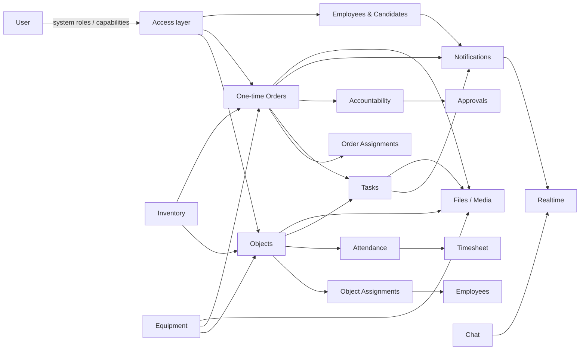
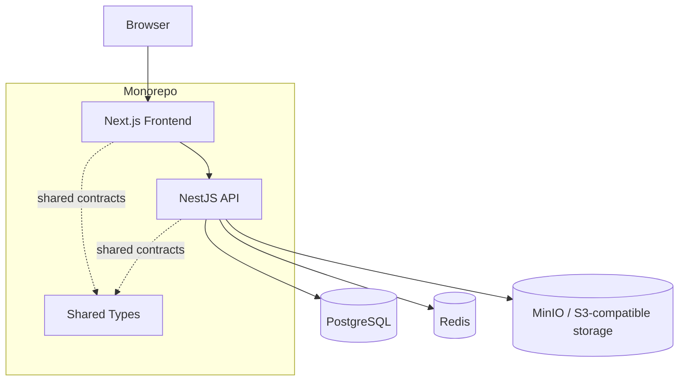
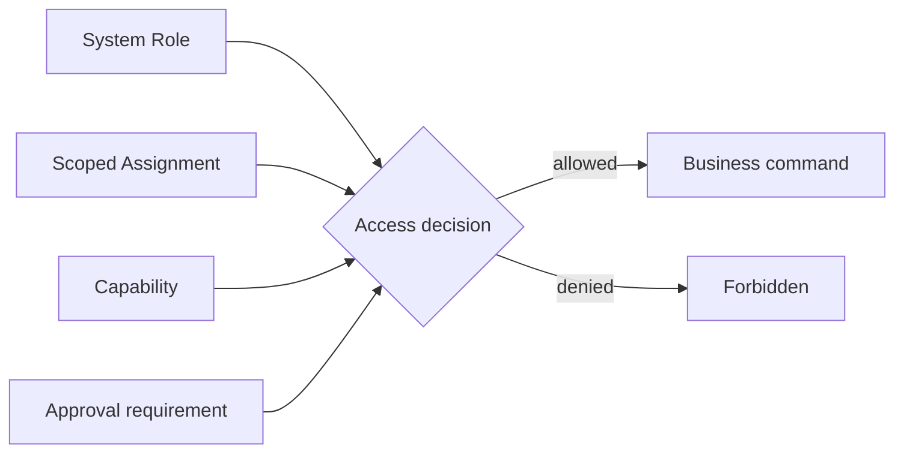

<div align="center">

# Service Ops CRM

### Операционная CRM для управления сервисным бизнесом: от объектов и сотрудников до задач, разовых заказов, табеля, склада и финансовой ответственности.

**Product & Engineering Project · Дмитрий Крючков**

[](https://github.com/JSwhiz/service-ops-crm/actions/workflows/ci.yml)


</div>

---

## О проекте

**Service Ops CRM** — full-stack система для ежедневного управления операционной деятельностью сервисной компании. Проект объединяет в одной модели регулярные объекты, разовые заказы, сотрудников, кандидатов, задачи, посещаемость, табель, складские движения, оборудование, подотчёт, подтверждения, файлы, коммуникации и уведомления.

Это не демонстрационный CRUD и не набор независимых административных страниц. Система строится вокруг реальных operational workflows: пользователь получает доступ не просто потому, что у него есть «роль», данные не теряют исторический смысл при изменении текущего состояния, финансовые и кадровые действия имеют отдельные границы доступа, а связанные домены должны сохранять согласованность между собой.

Репозиторий одновременно является:

- рабочей кодовой базой продукта;
- инженерной документацией архитектурных решений;
- точкой входа для разработчика, который подключается к проекту;
- технической презентацией проекта и подхода к его разработке.

> [!IMPORTANT]
> В README намеренно нет реальных имён сотрудников, заказчиков, объектов, production-адресов, credentials и иных customer-specific данных. Примеры и описания относятся только к абстрактной продуктовой модели.

---

## Содержание

- [Что решает система](#что-решает-система)
- [Карта доменов](#карта-доменов)
- [Архитектура](#архитектура)
- [Почему архитектура устроена именно так](#почему-архитектура-устроена-именно-так)
- [Модель доступа](#модель-доступа)
- [Ключевые домены](#ключевые-домены)
- [Golden paths](#golden-paths)
- [Технологический стек](#технологический-стек)
- [Структура репозитория](#структура-репозитория)
- [Backend](#backend)
- [Frontend](#frontend)
- [Данные, файлы и realtime](#данные-файлы-и-realtime)
- [Быстрый старт](#быстрый-старт)
- [Локальная разработка](#локальная-разработка)
- [Переменные окружения](#переменные-окружения)
- [Prisma и миграции](#prisma-и-миграции)
- [Качество, тесты и CI](#качество-тесты-и-ci)
- [Production safety](#production-safety)
- [Как вносить изменения](#как-вносить-изменения)
- [Документация](#документация)
- [Автор и ownership](#автор-и-ownership)
- [Лицензия](#лицензия)

---

## Что решает система

В операционном сервисном бизнесе одна операция редко живёт в одной таблице. Сотрудник назначается на объект, его присутствие влияет на табель; разовый заказ имеет менеджера, задачи, материалы, фото и финансовый контур; складское движение должно сохранять цену на момент операции; чувствительное изменение может требовать отдельного подтверждения; доступ к карточке сущности не всегда означает право изменить её финансовую часть.

Service Ops CRM сводит эти процессы в единую систему и сохраняет их связи.

| Контур | Что находится в системе |
| --- | --- |
| **Objects** | регулярные объекты, ответственные, менеджеры, staffing, operational activity |
| **One-time Orders** | разовые заказы, scoped-менеджеры, участники, календарь, выполнение, оплаты |
| **Tasks** | задачи, несколько исполнителей, visibility, сроки, результат и подтверждение |
| **Employees** | отдельный HR registry, состояние сотрудника и история назначений |
| **Candidates** | кандидаты, назначения, SLA и workflow обработки |
| **Attendance & Timesheet** | факт присутствия и исторический расчётный табель |
| **Inventory** | центральный склад, приходы, выдачи, списания и price snapshots |
| **Equipment** | штучное оборудование, состояние, текущая привязка и история движения |
| **Accountability** | выдача средств, расходы, сверки и финансовая история |
| **Approvals** | подтверждение чувствительных действий как отдельный cross-domain механизм |
| **Chat** | комнаты, сообщения, ответы, реакции, редактирование и realtime |
| **Notifications** | системные события и переходы к связанным сущностям |
| **Files** | единая attachment/storage foundation для фото, документов и preview |
| **Audit & Access** | серверные permission boundaries и аудит чувствительных операций |

---

## Карта доменов



Диаграмма показывает conceptual relationships, а не физическую Prisma ERD. Полная модель данных значительно шире и остаётся в schema/migrations и специализированной документации.

---

## Архитектура

Проект реализован как **TypeScript monorepo** с модульным NestJS backend и Next.js frontend. Основные инфраструктурные зависимости запускаются локально через Docker Compose.



### Архитектурный подход

Backend организован как **modular monolith**: домены изолированы на уровне NestJS modules, но развиваются в одной транзакционно согласованной системе. Для текущего масштаба это сознательный выбор: бизнес-процессы тесно связаны, а преждевременное разбиение на микросервисы увеличило бы сетевую и operational complexity без эквивалентной продуктовой выгоды.

Frontend не является источником истины для authorization. Он отображает доступные действия и улучшает UX, но окончательное решение о доступе принимает backend.

---

## Почему архитектура устроена именно так

### `User != Employee`

Это один из базовых invariants системы.

**User** — субъект авторизации: он входит в CRM, имеет system roles, permissions/capabilities и scoped assignments.

**Employee** — HR/операционная сущность: человек, который может работать на объектах, иметь ставку, историю назначений и участвовать в учётных процессах.

Эти понятия нельзя объединять только потому, что оба описывают человека. Сотруднику не обязательно нужен аккаунт в CRM, а системный пользователь не обязан быть линейным сотрудником. Разделение предотвращает смешивание authentication/RBAC с кадровыми данными и позволяет обоим lifecycle развиваться независимо.

### `Staffing != Attendance != Timesheet`

- **Staffing** отвечает на вопрос: кто относится к составу объекта.
- **Attendance** фиксирует факт присутствия в конкретную дату.
- **Timesheet** является учётным и историческим слоем.

Если строить табель только из текущего staffing, прошлые данные начинают исчезать после перевода сотрудника. Если пересчитывать прошлые дни по текущей ставке, история меняется задним числом. Поэтому сохранённые historical values являются отдельной частью модели.

### `Inventory != Equipment`

Расходники и штучное оборудование имеют разную семантику.

Inventory — количественный ledger: приход, выдача, списание, возврат/корректировка, цена операции.

Equipment — unit-based lifecycle: конкретная единица оборудования имеет состояние, текущую привязку и историю перемещений. Выдача оборудования не означает его расход.

### `Role != Assignment != Capability`

Глобальная должность пользователя не должна автоматически давать одинаковые права на каждую сущность. Поэтому система разделяет global role, назначение в конкретном scope и адресную capability. Подробнее — ниже.

### История важнее текущего состояния

Для финансов, табеля, движения склада и других audit-sensitive контуров система старается сохранять значение **на момент события**, а не восстанавливать прошлое из текущих справочников. Отсюда price snapshots, persisted timesheet values, movement history и отдельные reconciliation/approval records.

---

## Модель доступа

Authorization строится не вокруг одной плоской RBAC-таблицы. В системе используются четыре взаимодополняющих слоя.



### 1. System role

Глобальная роль описывает системный уровень ответственности пользователя. В модели существуют leadership, management, HR и technical roles.

### 2. Scoped assignment

Назначение связывает пользователя с конкретной операционной сущностью. Например:

- `responsible` и `manager` — object assignments;
- `one_time_manager` — one-time-order assignment.

Assignment **не является system role** и не должен случайно превращаться в глобальное право.

### 3. Capability / permission

Адресная capability разрешает конкретное действие, которое не следует автоматически из широкой роли. Это особенно важно для HR, финансовых и корректирующих операций.

Примеры существующего подхода:

```text
employees.view
employees.edit
employees.archive
employees.assignments.manage

timesheet.manual_correction

one_time_order.manage_all
one_time_order.review.edit
one_time_order.calendar.manage
```

### 4. Approval

Некоторые действия требуют не только permission, но и отдельного подтверждения. Approval реализован как самостоятельный cross-domain mechanism, а не как случайный boolean внутри каждой сущности.

> [!CAUTION]
> **Backend permissions are authoritative.** Скрытая кнопка во frontend — UX, а не security boundary. Новый endpoint или command должен защищаться на сервере независимо от состояния UI.

Канонические правила доступа находятся в [`docs/product/product-contract.md`](docs/product/product-contract.md) и специализированных access matrices. README объясняет модель, но не заменяет эти документы.

---

## Ключевые домены

### Objects

Object — регулярная операционная единица системы. Вокруг объекта строятся ответственные и менеджеры, staffing, attendance, timesheet, operational reports, файлы, складские операции и связанные задачи.

Создание и core-management отделены от ежедневной операционной работы. Пользователь может иметь широкий operational access к объекту, не получая автоматически право изменять его финансовые или core-параметры.

### Object Operations

Операционная активность объекта вынесена из его master-data. Здесь находятся факты ежедневной работы: attendance/arrival, reports, comments, feed и связанные действия. Такое разделение не позволяет карточке объекта превратиться в одну огромную mutable entity.

### Tasks

Task — workflow entity, а не просто `title + done`.

Модель поддерживает несколько исполнителей, priority, сроки, связь с Object или One-Time Order, visibility, результат, подтверждение выполнения и lifecycle завершения. Часть задач может проходить через `awaiting_confirmation` и auto-close flow, поэтому UI-команда «выполнить» не должна подменяться прямой установкой статуса.

Открытые продуктовые решения и найденные ACL inconsistencies фиксируются в GitHub Issues и canonical docs до изменения поведения.

### One-time Orders

Разовый заказ — самостоятельный домен, а не специальный тип Object. Он имеет собственные assignments, calendar/availability logic, участников, workflow выполнения, review, payment model, фото, задачи и связь с accountability.

Scoped manager заказа получает права в рамках конкретного order и не становится leadership/global manager автоматически.

### Employees

Employee registry отделён от Users. HR-контур хранит операционные данные сотрудника, lifecycle и историю назначений. Доступ к просмотру, редактированию, архивированию и управлению assignments разделён на отдельные permissions.

### Candidates

Candidate существует отдельно от Employee и проходит собственный workflow обработки. Assignment, SLA и reminder/notification foundation позволяют рассматривать кандидатов как operational inbox, а не как ещё одну таблицу сотрудников.

### Attendance & Timesheet

Attendance фиксирует факт присутствия. Timesheet хранит расчётное значение дня и месячную историю. Persisted historical value не должен неожиданно изменяться из-за новой текущей ставки или изменения текущего назначения сотрудника.

Manual correction рассматривается как чувствительное действие и имеет более узкую permission boundary, чем обычный просмотр табеля.

### Inventory

Inventory построен как центральный ledger. Остаток выводится из движений, а каждое финансово значимое движение хранит price snapshots. Изменение текущей цены номенклатуры не переписывает стоимость старых операций.

### Equipment

Equipment — unit-based domain. Конкретная единица может находиться на складе, быть назначена на Object/One-Time Order, находиться в ремонте, быть сломанной, потерянной или списанной. Current state материализован на unit, история — в movements.

### Accountability

Подотчёт — отдельный финансовый контур: funding, expenses, reconciliation и связанная история. Он не должен сводиться к одному вычисляемому полю «долг пользователя», потому что для проверки и восстановления событий необходима последовательность операций.

### Approvals

Approval layer используется для sensitive actions, где одного права инициировать действие недостаточно. Это позволяет отделить намерение пользователя от фактического применения критичного изменения.

### Chat

Chat — самостоятельная communication subsystem с комнатами, сообщениями, replies, reactions, edit/delete semantics и realtime layer. Он не смешивается с domain comments: комментарий к объекту и личная/групповая коммуникация имеют разные задачи.

### Notifications

Notifications — общий delivery layer для значимых событий. Производители уведомлений подключаются доменами постепенно; уведомление должно учитывать access и вести пользователя к реальной сущности/действию, а не быть vanity event.

### Files

Files/storage реализованы как platform capability. Фото и документы разных доменов используют общий attachment/storage baseline и preview/derivative infrastructure вместо независимых upload-механизмов на каждой странице.

---

## Golden paths

Golden path — это сквозной бизнес-сценарий, на котором проверяется не отдельная страница, а согласованность нескольких доменов.

```text
Object
  → Object Assignment
  → Employee staffing
  → Attendance
  → Timesheet
```

```text
One-Time Order
  → scoped manager
  → operational work
  → completion / review
  → payment
  → accountability
```

```text
Candidate
  → assignment
  → SLA / reminder
  → decision
  → дальнейший HR workflow
```

```text
Task
  → visibility / scope
  → assignee
  → work result
  → confirmation when required
  → completion / auto-close
```

```text
Inventory / Equipment event
  → domain validation
  → evidence / attachment when required
  → movement history
  → related Object or One-Time Order
```

Актуальный индекс сквозных сценариев: [`docs/product/golden-path-index.md`](docs/product/golden-path-index.md).

---

## Технологический стек

| Layer | Technology | Назначение |
| --- | --- | --- |
| Language | **TypeScript 5.7** | единый язык frontend/backend/contracts |
| Runtime | **Node.js 22** | application runtime |
| Package manager | **pnpm 10.33** | monorepo dependency/workspace management |
| Frontend | **Next.js 15 + React 18** | web application |
| Backend | **NestJS 10** | modular HTTP/application layer |
| ORM | **Prisma 6** | schema, migrations, typed DB access |
| Database | **PostgreSQL** | primary transactional storage |
| Realtime/cache | **Redis** | realtime/infrastructure coordination |
| Object storage | **MinIO / S3 API** | files, photos and derivatives |
| Validation | **class-validator / class-transformer** | backend DTO validation |
| Auth | **Passport + JWT** | authentication foundation |
| Media | **Sharp** | image processing / previews |
| Containers | **Docker Compose** | local infrastructure and containerized dev |
| Quality | **ESLint + TypeScript + GitHub Actions** | static checks and CI |

Versions above describe the current repository baseline and should be updated together with dependency upgrades.

---

## Структура репозитория

```text
service-ops-crm/
├── apps/
│   ├── backend/                 # NestJS application
│   │   ├── prisma/              # schema, migrations, seed
│   │   ├── scripts/             # backend operational/dev scripts
│   │   ├── src/
│   │   │   ├── common/          # shared backend concerns
│   │   │   ├── config/          # application configuration
│   │   │   ├── infrastructure/  # DB/Redis/storage adapters
│   │   │   └── modules/         # business modules
│   │   └── test/                # integration coverage
│   └── frontend/                # Next.js application
│       └── src/
│           ├── app/             # routing / application entry
│           ├── entities/        # domain entities/contracts/UI
│           ├── features/        # user-facing actions/workflows
│           ├── shared/          # shared UI/lib/config
│           └── widgets/         # composed application blocks
├── packages/
│   ├── shared-types/            # shared TypeScript contracts
│   └── tsconfig/                # shared TS configuration
├── docs/                        # product, architecture and domain docs
├── scripts/                     # repository bootstrap/runtime helpers
├── docker-compose.dev.yml       # local infrastructure / Docker dev
├── docker-compose.prod.yml      # production composition
├── package.json                 # workspace commands
├── pnpm-workspace.yaml
└── README.md
```

Реальное дерево остаётся источником истины: при появлении нового top-level package этот раздел должен обновляться вместе с архитектурным изменением.

---

## Backend

Backend — modular NestJS application. На текущем этапе в нём присутствуют самостоятельные модули для authentication/access, objects, object operations, tasks, one-time orders, employees, candidates, timesheets, inventory, equipment, accountability, approvals, chats, notifications и files.

Типичный доменный модуль содержит:

```text
modules/<domain>/
├── dto/                  # transport validation / command input
├── types/                # domain/application types
├── utils/                # scoped access and domain helpers
├── <domain>.controller.ts
├── <domain>.service.ts
└── <domain>.module.ts
```

Это не жёсткое требование к каждой папке, а общий pattern. Business rules должны находиться на backend и быть тестируемыми независимо от UI.

### Backend design rules

1. **Controller не является местом для бизнес-логики.** Он принимает transport input, применяет guards/decorators и делегирует application/domain operation.
2. **Prisma schema не заменяет domain contract.** Возможность записать значение в колонку не означает, что операция разрешена бизнесом.
3. **Access проверяется сервером.** Frontend visibility не используется как доказательство permission.
4. **Sensitive actions отделяются от обычного edit.** Для них используются отдельные permissions/approvals/audit trail.
5. **Historical records не пересчитываются без явного бизнес-основания.** Особенно в finance/timesheet/inventory.
6. **Cross-domain изменение проверяется как workflow.** Нельзя исправить связанный модуль только локальным условием, если это нарушает другой scope.

---

## Frontend

Frontend построен на Next.js и разделён на application routing, entities, features, shared infrastructure и composed widgets.

Ключевая ответственность frontend — представить существующую domain model максимально быстро и понятно пользователю, не дублируя security logic backend.

### Frontend design rules

- entity types/contracts должны переиспользоваться, а не копироваться между страницами;
- permission-driven action скрывается/показывается для UX, но backend всё равно валидирует command;
- complex entity не должна превращаться в бесконечный stack карточек;
- loading, empty, error и permission-denied states являются частью feature, а не необязательной полировкой;
- destructive/sensitive actions должны визуально отличаться от обычного edit;
- filters/search/table interactions должны быть консистентны между доменами;
- новый UI не имеет права менять business semantics «заодно с redesign».

Текущая визуальная переработка ведётся отдельно от бизнес-логики и отслеживается через GitHub Issues; README описывает архитектуру продукта, а не временное состояние макетов.

---

## Данные, файлы и realtime

### PostgreSQL

Primary transactional database. Prisma schema и migrations фиксируют evolution модели данных. Сложные домены используют отдельные records/history вместо перезаписи одного агрегированного значения там, где это необходимо для аудита.

### Redis

Используется инфраструктурным/realtime слоем. Redis не должен становиться единственным источником истины для данных, потеря которых меняет бизнес-состояние.

### MinIO

S3-compatible object storage для файлов и media. Метаданные attachment живут в application/database layer, бинарные объекты — в storage. Preview/derivative pipeline отделён от исходного файла.

---

## Быстрый старт

### Требования

Перед запуском нужны:

- **Node.js 22**;
- **pnpm 10.33.x**;
- **Docker + Docker Compose**;
- свободные локальные порты, используемые dev infrastructure.

Установить зависимости:

```bash
pnpm install
```

### Рекомендуемый режим: приложения на host, инфраструктура в Docker

```bash
pnpm bootstrap:local
```

Затем в отдельных терминалах:

```bash
pnpm --filter backend start:dev
```

```bash
pnpm --filter frontend dev
```

Bootstrap создаёт отсутствующие local env-файлы из examples, подготавливает PostgreSQL/Redis/MinIO, генерирует Prisma Client, применяет local migrations, выполняет local seed и обеспечивает наличие первого founder-admin для development environment.

### Полностью Docker-based development

```bash
pnpm bootstrap:docker
```

После bootstrap доступны команды управления stack:

```bash
pnpm dev:docker:up
pnpm dev:docker:ps
pnpm dev:docker:logs
pnpm dev:docker:down
```

---

## Локальная разработка

### Infrastructure-only команды

```bash
pnpm infra:up
pnpm infra:ps
pnpm infra:logs
pnpm infra:down
```

Полный reset локальных volumes:

```bash
pnpm infra:reset
```

> [!WARNING]
> `infra:reset` и `dev:docker:reset` удаляют **локальные Docker volumes**. Эти команды предназначены только для disposable development environment и никогда не должны переноситься в production workflow.

### Основные workspace команды

```bash
pnpm build
pnpm lint
pnpm typecheck
pnpm ci:check
pnpm workspace:list
```

Backend integration tests:

```bash
pnpm test:backend:integration
```

Database helpers:

```bash
pnpm db:generate
pnpm db:migrate
pnpm db:seed
```

---

## Переменные окружения

Проект разделяет конфигурацию infrastructure, backend и frontend. Bootstrap scripts создают отсутствующие local env-файлы из repository examples.

Конкретные secrets, production credentials, hostnames и customer infrastructure **не должны появляться в README, issue descriptions, fixtures или screenshots**.

Принцип конфигурации:

```text
repository examples
      ↓
local environment files
      ↓
runtime configuration loader
      ↓
application / infrastructure
```

При добавлении новой обязательной переменной разработчик должен обновить соответствующий example и bootstrap/validation path, а не рассчитывать на «секретное знание» локальной машины.

---

## Prisma и миграции

Database schema развивается только через versioned migrations.

### Development

Для создания новой migration в development environment используется repository command:

```bash
pnpm db:migrate
```

Он вызывает Prisma `migrate dev` с local backend environment.

### CI / Production

Применение уже созданных migrations выполняется через:

```bash
pnpm --filter backend prisma:deploy
```

то есть `prisma migrate deploy`.

### Правила

- migration создаётся и проверяется **до** production deployment;
- уже применённую migration нельзя тихо переписывать как способ «исправить историю»;
- destructive schema changes требуют отдельной оценки данных и rollback/restore strategy;
- production database никогда не является playground для `migrate dev`;
- seed — development/CI mechanism, а не production deployment step;
- изменение schema должно проверяться вместе с runtime code, integration tests и реальным data lifecycle.

---

## Качество, тесты и CI

Репозиторий использует GitHub Actions как обязательный технический baseline перед release decision.

CI поднимает isolated infrastructure и проверяет приложение в условиях, близких к локальному stack:

```text
install dependencies
        ↓
PostgreSQL + Redis + MinIO
        ↓
Prisma generate
        ↓
Prisma migrate deploy
        ↓
CI seed
        ↓
backend typecheck
        ↓
frontend typecheck
        ↓
backend integration tests
        ↓
lint + builds / ci:check
```

Локально итоговый static/build gate запускается так:

```bash
pnpm ci:check
```

Но green build не заменяет domain verification: изменение access control, финансовой истории, lifecycle или cross-domain workflow должно иметь соответствующие positive и negative tests.

---

## Production safety

> [!CAUTION]
> **Production содержит persistent operational data. Потеря данных важнее скорости релиза.**

Ниже — не deployment runbook, а минимальные safety invariants репозитория.

### Никогда в production

```text
❌ docker compose down -v
❌ prisma migrate dev
❌ development / CI seed
❌ удаление volumes ради "чистого запуска"
❌ ручное исправление migration history без расследования
❌ deployment неподтверждённого SHA
❌ хранение production secrets в Git
```

### Production migration

```text
✓ backup / preflight
✓ exact reviewed commit SHA
✓ prisma migrate deploy
✓ application restart / rollout
✓ health checks
✓ smoke verification
✓ rollback/restore plan for risky changes
```

Production state нельзя выводить только из состояния `dev`: перед релизом проверяются фактически deployed SHA, migration status и состояние infrastructure.

---

## Как вносить изменения

Перед изменением бизнес-логики разработчик должен сначала понять, **какой документ является источником истины**.

Приоритет:

```text
1. Явное актуальное product requirement / task
2. Canonical product documentation
3. Existing conventions and runtime implementation
```

Если runtime расходится с canonical contract, текущее поведение не становится автоматически новым требованием — это может быть drift.

### Обязательный onboarding path

Перед существенным domain change прочитайте:

1. [`Product Contract`](docs/product/product-contract.md)
2. access matrices соответствующего домена
3. glossary / canonical terminology, если изменение затрагивает naming
4. [`Open Questions Register`](docs/product/open-questions-register.md)
5. [`Reconciliation Notes`](docs/product/reconciliation-notes.md)
6. [`Golden Path Index`](docs/product/golden-path-index.md)

После этого:

1. найдите существующий backend access boundary;
2. проверьте Prisma/data lifecycle;
3. проверьте frontend behavior и shared contracts;
4. определите затрагиваемые golden paths;
5. добавьте/обновите tests;
6. выполните `pnpm ci:check` и необходимые integration tests;
7. только затем рассматривайте изменение готовым к merge/release.

### Что не стоит делать

- создавать второй способ решить уже существующую domain operation;
- переносить authorization во frontend;
- смешивать system role и scoped assignment;
- связывать User и Employee «по совпадению человека» без явного relation/contract;
- пересчитывать историю из текущего состояния;
- обходить approval ради более простой кнопки;
- менять backend semantics внутри визуального redesign без отдельного требования;
- исправлять cross-domain проблему только в одном экране.

---

## Документация

README — карта системы и точка входа. Детальные правила живут в `docs/` и остаются каноническими для своих областей.

### Product core

- [`Product Contract`](docs/product/product-contract.md) — каноническая продуктовая модель и invariants.
- [`Golden Path Index`](docs/product/golden-path-index.md) — сквозные бизнес-сценарии.
- [`Open Questions Register`](docs/product/open-questions-register.md) — вопросы, которые нельзя молча решить инженерным предположением.
- [`Reconciliation Notes`](docs/product/reconciliation-notes.md) — reconciliation между требованиями и runtime.
- [`Implementation Roadmap`](docs/product/implementation_roadmap.md) — история/план реализации; не заменяет current contract.

### Domain documentation

В `docs/` также находятся специализированные state/access документы, включая:

- [`Employee access matrix`](docs/employee-access-matrix.md)
- [`Employee state model`](docs/employee-state-model.md)
- [`One-time Orders access matrix`](docs/one-time-orders-access-matrix.md)
- [`One-time Orders state model`](docs/one-time-orders-state-model.md)
- [`One-time Order financial model`](docs/one-time-order-financial-model.md)
- [`Inventory access matrix`](docs/inventory-access-matrix.md)
- [`Inventory state model`](docs/inventory-state-model.md)
- [`Accountability access matrix`](docs/accountability-access-matrix.md)

> [!NOTE]
> Документационный слой развивается вместе с кодом. Если README и canonical domain document расходятся, не выбирайте более удобную формулировку: сначала установите актуальный contract и исправьте drift осознанно.

---

## Автор и ownership

**Дмитрий Крючков** — автор, владелец и основной maintainer проекта Service Ops CRM.

Проект отражает не только реализацию отдельных функций, но и полный инженерный цикл: декомпозицию бизнес-процессов, domain modeling, access architecture, full-stack разработку, миграции данных, CI, production safety и развитие продуктового UX.

Текущее название **Service Ops CRM** является рабочим. Финальный branding, naming и repository identity будут определены отдельным продуктовым этапом и не должны меняться фрагментарно.

---

## Лицензия

Copyright © 2026 **Dmitry Kryuchkov**. All rights reserved.

Этот репозиторий распространяется как **proprietary software**. Публичный или предоставленный доступ к исходному коду **не предоставляет право** использовать, копировать, модифицировать, распространять, продавать, размещать, развёртывать, создавать производные работы или иным образом эксплуатировать проект без предварительного письменного разрешения правообладателя.

Полные условия: [`LICENSE`](LICENSE).

---

<div align="center">

**Service Ops CRM** · Designed and engineered by **Дмитрий Крючков**

</div>
